# Workflow Per-File Trace Documentation

**Project**: Legal Chatbot RAG (Indonesian Law Assistant)  
**Last Updated**: 2026-09-03  
**Status**: Production Ready & Fully Remediated (All 15 Unit Tests Passing)  
**Scope**: Full Stack (Frontend Streamlit, Backend FastAPI, LlamaIndex RAG Engine, ChromaDB Vector Store, Ingestion ETL, Automated Testing Suite, and Docker Infrastructure)  

---

## 📋 Table of Contents

- [Workflow Per-File Trace Documentation](#workflow-per-file-trace-documentation)
  - [📋 Table of Contents](#-table-of-contents)
  - [🏗️ Project Architecture & Network Topology](#️-project-architecture--network-topology)
  - [📁 Per-Layer File Analysis](#-per-layer-file-analysis)
    - [Layer 1: Presentation / Frontend Layer](#layer-1-presentation--frontend-layer)
      - [`frontend/app.py`](#frontendapppy)
      - [`frontend/requirements.txt`](#frontendrequirementstxt)
    - [Layer 2: API & Application Server Layer](#layer-2-api--application-server-layer)
      - [`backend/main.py`](#backendmainpy)
      - [`backend/app/api.py`](#backendappapipy)
    - [Layer 3: RAG Core & Intelligence Services](#layer-3-rag-core--intelligence-services)
      - [`backend/app/engine.py`](#backendappenginepy)
    - [Layer 4: Data Ingestion & ETL Pipeline](#layer-4-data-ingestion--etl-pipeline)
      - [`backend/app/ingest.py`](#backendappingestpy)
    - [Layer 5: Configuration & Core System Utilities](#layer-5-configuration--core-system-utilities)
      - [`backend/app/config.py`](#backendappconfigpy)
      - [`backend/app/utils.py`](#backendapputilspy)
      - [`backend/app/__init__.py`](#backendapp__init__py)
    - [Layer 6: Automated Testing Suite (Pytest)](#layer-6-automated-testing-suite-pytest)
      - [`tests/conftest.py`](#testsconftestpy)
      - [`tests/test_api_auth.py`](#teststest_api_authpy)
      - [`tests/test_health.py`](#teststest_healthpy)
      - [`tests/test_utils.py`](#teststest_utilspy)
      - [`tests/test_validation.py`](#teststest_validationpy)
    - [Layer 7: DevOps, Containerization & Dependencies](#layer-7-devops-containerization--dependencies)
      - [`docker-compose.yml`](#docker-composeyml)
      - [`Dockerfile.backend`](#dockerfilebackend)
      - [`Dockerfile.frontend`](#dockerfilefrontend)
      - [`backend/requirements.txt`](#backendrequirementstxt)
      - [`requirements.txt`](#requirementstxt)
      - [`.dockerignore`](#dockerignore)
      - [`.gitignore`](#gitignore)
      - [`.env.example`](#envexample)
      - [`README.md`](#readmemd)
    - [Layer 8: Knowledge Base & Datasets](#layer-8-knowledge-base--datasets)
      - [`Data/raw/UU Nomor 22 Tahun 2009.pdf`](#datarawuu-nomor-22-tahun-2009pdf)
  - [🔗 End-to-End Traces](#-end-to-end-traces)
    - [Trace 1: Real-Time Legal Consultation Query (Happy Path)](#trace-1-real-time-legal-consultation-query-happy-path)
    - [Trace 2: Document Ingestion & Vector Indexing Batch Flow](#trace-2-document-ingestion--vector-indexing-batch-flow)
    - [Trace 3: Application Lifespan Bootstrapping & Engine Warmup](#trace-3-application-lifespan-bootstrapping--engine-warmup)
    - [Trace 4: Healthcheck Liveness & Readiness Probe Flow](#trace-4-healthcheck-liveness--readiness-probe-flow)
    - [Trace 5: Automated Testing Execution (Pytest In-Memory)](#trace-5-automated-testing-execution-pytest-in-memory)
  - [🛡️ Remediation Status & Architecture Audit](#️-remediation-status--architecture-audit)
    - [Resolved Critical Issues (P0 Blockers)](#resolved-critical-issues-p0-blockers)
    - [Pembersihan Artefak Sampah (Junk Cleaned)](#pembersihan-artefak-sampah-junk-cleaned)
  - [📝 Operational Runbook Reference](#-operational-runbook-reference)
  - [🗺️ Recommended Reading Order & Learning Path (Peta Jalur Belajar)](#️-recommended-reading-order--learning-path-peta-jalur-belajar)

---

## 🏗️ Project Architecture & Network Topology

Proyek ini mengimplementasikan sistem **Advanced Retrieval-Augmented Generation (RAG)** untuk konsultasi regulasi hukum Indonesia (spesifik UU No. 22 Tahun 2009 tentang Lalu Lintas dan Angkutan Jalan). Arsitektur dirancang dengan pemisahan dependensi mikro (*split requirements*), jaringan privat terisolasi, proteksi API Key & Rate Limit ganda, serta endpoint pemantauan aktif.

```
[ User / Browser Client ]
        │
        ▼ HTTP (Port 8501)
┌─────────────────────────────────────────────────────────┐
│  FRONTEND CONTAINER (Streamlit UI)                      │
│  - frontend/app.py (Chat state, UI, specific HTTP alerts)│
│  - frontend/requirements.txt (~180 MB slim container)   │
└───────────────────────────┬─────────────────────────────┘
                            │ HTTP POST /chat (Port 8000)
                            ▼ (Headers: X-API-Key)
┌─────────────────────────────────────────────────────────┐
│  BACKEND CONTAINER (FastAPI + LlamaIndex RAG)           │
│  - backend/main.py (App lifespan, GET /health, limiter) │
│  - backend/app/api.py (Auth, @limiter.limit, validator) │
│  - backend/app/config.py (Pydantic Settings v2)         │
│  - backend/app/utils.py (Token, citation, heartbeat)    │
│  - backend/app/engine.py (LlamaIndex ContextChatEngine) │
└─────────────┬───────────────────────────┬───────────────┘
              │                           │
    (1) Dense │ Top-10                    │ (2) Top-3
    Retrieval │ Embeddings                │ LLM Inference
              ▼                           ▼
┌───────────────────────────┐   ┌─────────────────────────┐
│ CHROMADB CONTAINER        │   │ GROQ CLOUD API          │
│ (Internal Bridge Network) │   │ Model:                  │
│ Port 8000 (No host ports) │   │ llama-3.3-70b-versatile │
│ Collection: 'legal_docs'  │   │                         │
└───────────────────────────┘   └─────────────────────────┘
              ▲
              │ ETL Batch Ingestion
┌─────────────┴───────────────────────────────────────────┐
│  DATA INGESTION PIPELINE                                │
│  - backend/app/ingest.py                                │
│  - Data/raw/UU Nomor 22 Tahun 2009.pdf                  │
└─────────────────────────────────────────────────────────┘
```

---

## 📁 Per-Layer File Analysis

### Layer 1: Presentation / Frontend Layer
Layer presentasi mengelola antarmuka interaktif percakapan hukum, visualisasi metadata retrieval, penanganan respons HTTP spesifik (429 Rate Limit, 503 Engine Offline, 403 Auth Error), dan persistensi sesi pengguna.

#### `frontend/app.py`
**Peran:** Antarmuka web pengguna berbasis Streamlit yang mengelola input chat hukum, komunikasi HTTP REST client ke backend FastAPI, serta rendering histori obrolan beserta metadata sitasi.  
**Import lokal:** Tidak ada (murni berinteraksi via REST API HTTP ke backend).  
**Dependencies:** `streamlit`, `requests`, `python-dotenv`.

| Entry Point | Called By | Calls | Input | Output / Side Effect |
|---|---|---|---|---|
| `top-level script execution` | Streamlit Engine (`streamlit run frontend/app.py`) saat load awal & setiap event interaksi | `load_dotenv()`, `requests.post()`, `st.set_page_config()`, `st.title()`, `st.chat_message()`, `st.chat_input()`, `st.error()`, `st.warning()`, `st.session_state` | State sesi browser, input teks pengguna via `st.chat_input` | Menginisialisasi session state `messages`, memvalidasi ketersediaan `APP_API_KEY`, mengirim HTTP `POST {BACKEND_URL}/chat`, menangani status code 200, 429, 503, 403, 422, dan me-render hasil ke layar |

#### `frontend/requirements.txt`
**Peran:** Deklarasi dependensi terisolasi khusus frontend web. Hanya memuat pustaka antarmuka (`streamlit`, `requests`, `python-dotenv`) tanpa pustaka AI berat, memangkas image Docker hingga >90%.

---

### Layer 2: API & Application Server Layer
Layer ini mengendalikan siklus hidup aplikasi (startup/shutdown), routing HTTP REST, validasi schema input/output Pydantic, otentikasi API Key, pembatasan laju panggilan (SlowAPI decorator), observabilitas `/health`, serta pendelegasian query ke engine AI.

#### `backend/main.py`
**Peran:** Entry point utama server FastAPI, mengelola startup lifespan (memuat AI engine ke state), mendaftarkan middleware rate limiter (`slowapi`), endpoint monitoring `/health`, dan routing API.  
**Import lokal:** `backend/app/api.py`, `backend/app/config.py`, `backend/app/utils.py` (lazy: `backend/app/engine.py`).

| Entry Point | Called By | Calls | Input | Output / Side Effect |
|---|---|---|---|---|
| `lifespan(app: FastAPI)` | FastAPI Lifecycle Context Manager saat server booting dan shutdown | `backend/app/engine.py::get_chat_engine()`, `logger.info()`, `logger.error()` | `app: FastAPI` | Memuat instance RAG Chat Engine ke `app.state.chat_engine` secara dinamis. Mengeluarkan log status booting/shutdown |
| `root(request: Request)` | HTTP Client via `GET /` | SlowAPI Limiter | `request: Request` | Mengembalikan JSON `{"message": "Legal Chatbot API is running securely!"}`. Dibatasi rate limit 5 request/menit |
| `health_check(request: Request)` | HTTP Client / Docker Healthcheck / K8s probe via `GET /health` | `backend/app/utils.py::check_chroma_heartbeat()` | `request: Request` | Mengembalikan JSON status kesiapan komponen (`ai_engine` & `chroma_db`). Return status 200 jika sehat, 503 jika degraded |
| `__main__ execution block` | CLI execution (`python backend/main.py`) | `uvicorn.run()` | None | Menjalankan web server ASGI Uvicorn pada host `0.0.0.0` port `8000` |

#### `backend/app/api.py`
**Peran:** Mendefinisikan endpoint inferensi `/chat`, skema Pydantic `ChatRequest` dengan validasi whitespace, proteksi header `X-API-Key`, dekorator pembatasan laju `@limiter.limit("5/minute")`, delegasi helper sitasi/token, dan penanganan khusus error kuota Groq (429).  
**Import lokal:** `backend/app/config.py`, `backend/app/utils.py`

| Entry Point | Called By | Calls | Input | Output / Side Effect |
|---|---|---|---|---|
| `get_api_key(api_key_header: str)` | FastAPI Dependency Injection (`Security(api_key_header)`) sebelum `/chat` dieksekusi | None | `api_key_header: str` (dari HTTP header `X-API-Key`) | Mengembalikan string API Key jika valid; Melempar `HTTPException(403)` jika mismatch dengan `settings.APP_API_KEY` |
| `ChatRequest(BaseModel)` | Pydantic Request Parsing Engine | `@field_validator("query")` | JSON Body request: `{"query": str}` | Memvalidasi tipe, membatasi panjang maks 500 karakter, menolak string kosong/whitespace only (HTTP 422) |
| `chat_endpoint(request: Request, body: ChatRequest, api_key: str)` | HTTP Client via `POST /chat` (dari `frontend/app.py` atau API client) | `@limiter.limit("5/minute")`, `chat_engine.achat()`, `estimate_tokens()`, `format_source_citations()` | `request: Request`, `body: ChatRequest`, `api_key: str` | Menghasilkan jawaban hukum RAG, metadata sitasi unik, latency, dan estimasi token. Menangani error Groq 429 secara spesifik |

---

### Layer 3: RAG Core & Intelligence Services
Layer inti yang mengabstraksi pemrosesan bahasa alami hukum, menghubungkan Vector Store ChromaDB, kalkulasi embedding HuggingFace, inferensi LLM Groq, dan re-ranking semantik.

#### `backend/app/engine.py`
**Peran:** Modul pembangun (factory) LlamaIndex `ContextChatEngine` yang mengkonfigurasi pipeline Advanced RAG: ChromaDB Vector Store, embedding `BAAI/bge-small-en-v1.5`, Groq LLM `llama-3.3-70b-versatile`, Cross-Encoder Re-ranker `ms-marco-MiniLM-L-6-v2`, serta System Prompt hukum formal.  
**Import lokal:** `backend/app/config.py`

| Entry Point | Called By | Calls | Input | Output / Side Effect |
|---|---|---|---|---|
| `get_chat_engine()` | `backend/main.py::lifespan()` saat aplikasi pertama kali boot | `chromadb.HttpClient()`, `db.get_collection("legal_docs")`, `ChromaVectorStore()`, `HuggingFaceEmbedding()`, `VectorStoreIndex.from_vector_store()`, `Groq()`, `SentenceTransformerRerank()`, `index.as_chat_engine()` | None (Membaca konfigurasi dari `settings`) | Mengembalikan instance `ContextChatEngine` yang terkonfigurasi dengan top-10 retrieval, top-3 reranker, dan system prompt hukum. Membuka koneksi TCP/HTTP ke ChromaDB server |

---

### Layer 4: Data Ingestion & ETL Pipeline
Layer pemrosesan data luring (offline) yang mengekstrak teks regulasi UU dari format PDF, melakukan segmentasi dokumen (chunking), komputasi dense embedding vektor, dan penyimpanan permanen ke dalam Vector Database.

#### `backend/app/ingest.py`
**Peran:** Script ETL batch mandiri untuk membaca dokumen PDF UU dari folder `Data/raw/`, memproses teks per halaman via `SimpleDirectoryReader`, membangun embedding vektor, dan memuatnya ke dalam koleksi ChromaDB `legal_docs`.  
**Import lokal:** `backend/app/config.py`

| Entry Point | Called By | Calls | Input | Output / Side Effect |
|---|---|---|---|---|
| `ingest_data()` | CLI Developer (`docker compose exec backend python app/ingest.py`) atau manual data pipeline job | `SimpleDirectoryReader.load_data()`, `chromadb.HttpClient()`, `db.get_or_create_collection("legal_docs")`, `ChromaVectorStore()`, `StorageContext.from_defaults()`, `HuggingFaceEmbedding()`, `VectorStoreIndex.from_documents()` | File PDF pada path `settings.raw_data_dir` (`Data/raw/`) | Membaca filesystem lokal, memproduksi representasi vektor, menyimpan index embedding ke server ChromaDB pada collection `legal_docs` |
| `__main__ execution block` | Eksekusi langsung via terminal | `ingest_data()` | None | Menjalankan fungsi `ingest_data()` saat script dipanggil langsung |

---

### Layer 5: Configuration & Core System Utilities
Layer yang mengelola konfigurasi berbasis environment variables, utilitas sistem, estimasi token, ekstraksi sitasi, dan pengecekan kesehatan server.

#### `backend/app/config.py`
**Peran:** Manajemen konfigurasi terpusat berbasis Pydantic v2 `SettingsConfigDict` yang memvalidasi environment variables (API Key, model AI, koneksi ChromaDB, dan path direktori proyek). Wajib menyediakan `APP_API_KEY` tanpa fallback hardcoded.  
**Import lokal:** Tidak ada.

| Entry Point | Called By | Calls | Input | Output / Side Effect |
|---|---|---|---|---|
| Class `Settings(BaseSettings)` | Diinstansiasi secara otomatis saat modul dimuat | `os.path.abspath()`, `os.path.dirname()`, `os.path.join()` | File `.env` dan Environment Variables OS | Memvalidasi dan menyimpan konfigurasi aplikasi: `GROQ_API_KEY`, `APP_API_KEY`, `LLM_MODEL`, `EMBEDDING_MODEL`, `RERANKER_MODEL`, `CHROMA_HOST`, `CHROMA_PORT`, dan property dinamis `raw_data_dir` |
| Property `raw_data_dir` | `backend/app/ingest.py::ingest_data()` | `os.path.join()` | Instance `Settings` (`self`) | Mengembalikan path absolut ke folder `Data/raw` |
| Instance `settings` | `backend/app/api.py`, `backend/app/engine.py`, `backend/app/ingest.py`, `backend/main.py` | `Settings()` constructor | None | Singleton objek konfigurasi global yang diakses di seluruh backend |

#### `backend/app/utils.py`
**Peran:** Modul utilitas terpusat berisi fungsi murni (*pure functions*) yang terisolasi dan mudah diuji: estimasi token, formatting sitasi, pengecekan heartbeat ChromaDB, dan shared SlowAPI Limiter instance.  
**Import lokal:** Tidak ada.

| Entry Point | Called By | Calls | Input | Output / Side Effect |
|---|---|---|---|---|
| `estimate_tokens(query: str, answer_text: str)` | `backend/app/api.py`, `tests/test_utils.py` | String methods | Dua string (query pengguna & jawaban model) | Menghitung perkiraan kasar total token berdasarkan rasio kata 1.3x secara cepat tanpa tokenizer overhead |
| `format_source_citations(source_nodes: list)` | `backend/app/api.py`, `tests/test_utils.py` | Attribute inspection | List objek node LlamaIndex | Mengekstrak metadata `file_name` dan `page_label`, mendeduplikasi referensi dokumen, dan mengurutkan secara alfabetis |
| `check_chroma_heartbeat(host: str, port: int)` | `backend/main.py::health_check()`, `tests/test_utils.py` | `chromadb.HttpClient.heartbeat()` (lazy import) | Host string & port int | Mengembalikan `True` jika server ChromaDB merespons heartbeat > 0, `False` jika offline/unreachable |
| `limiter` | `backend/main.py`, `backend/app/api.py` | `Limiter(key_func=get_remote_address)` | Client IP address | Shared instance SlowAPI Limiter yang digunakan bersama oleh route utama dan endpoint API |

#### `backend/app/__init__.py`
**Peran:** Penanda package Python untuk direktori `backend/app`.

---

### Layer 6: Automated Testing Suite (Pytest)
Suite pengujian otomatis in-memory berkecepatan tinggi (15 unit test berjalan dalam ~0.3 detik) yang memverifikasi lapisan keamanan, validasi data, fungsi utilitas, dan endpoint monitoring.

#### `tests/conftest.py`
**Peran:** Konfigurasi environment mock pengujian dan fixture `test_client` berbasis FastAPI `TestClient` dengan mock asynchronous chat engine, memungkinkan pengujian tanpa server ChromaDB riil atau kuota Groq.

#### `tests/test_api_auth.py`
**Peran:** 3 pengujian otentikasi header `X-API-Key`:
- `test_missing_api_key_header_returns_403`: Verifikasi request tanpa header ditolak HTTP 403.
- `test_invalid_api_key_header_returns_403`: Verifikasi request dengan key salah ditolak HTTP 403.
- `test_valid_api_key_header_succeeds`: Verifikasi request dengan key valid berhasil diproses HTTP 200.

#### `tests/test_health.py`
**Peran:** 2 pengujian endpoint sistem:
- `test_root_endpoint`: Verifikasi respons HTTP 200 pada root `/`.
- `test_health_endpoint_structure`: Verifikasi struktur payload JSON `/health` (`status`, `components`, `service`).

#### `tests/test_utils.py`
**Peran:** 5 pengujian fungsi utilitas:
- `test_estimate_tokens_normal` & `test_estimate_tokens_empty`: Verifikasi akurasi rasio kata ke token.
- `test_format_source_citations_with_duplicates`: Verifikasi deduplikasi metadata dokumen sumber unik.
- `test_format_source_citations_empty`: Verifikasi penanganan list kosong secara aman.
- `test_check_chroma_heartbeat_offline`: Verifikasi penanganan offline ChromaDB secara aman (mengembalikan `False` tanpa exception).

#### `tests/test_validation.py`
**Peran:** 5 pengujian skema validasi Pydantic:
- `test_valid_query_accepted`: Verifikasi query normal diterima dan whitespace di-trim.
- `test_blank_whitespace_query_rejected`: Verifikasi query whitespace ditolak (`ValidationError`).
- `test_empty_query_rejected`: Verifikasi query kosong ditolak.
- `test_query_exceeding_500_chars_rejected`: Verifikasi pembatasan panjang maksimum 500 karakter.
- `test_endpoint_returns_422_on_invalid_input`: Verifikasi endpoint mengembalikan HTTP 422 saat menerima input invalid.

---

### Layer 7: DevOps, Containerization & Dependencies
Layer infrastruktur dan orkestrasi kontainer yang mendefinisikan build environment, isolasi port internal, dependensi mikro terpisah, dan konfigurasi environment.

#### `docker-compose.yml`
**Peran:** Konfigurasi orkestrasi multi-kontainer Docker Compose untuk menjalankan tiga layanan:
- `chromadb`: Port host `8001` dihapus (terisolasi aman di internal network), volume `./Data/chroma:/chroma/chroma`, restart policy `unless-stopped`.
- `backend`: Port `8000:8000`, volume `./Data:/app/Data`, env propagation, restart `unless-stopped`.
- `frontend`: Port `8501:8501`, env `APP_API_KEY` dan `BACKEND_URL`, restart `unless-stopped`.

#### `Dockerfile.backend`
**Peran:** Resep pembuatan image Docker untuk backend API berbasis Python 3.10 slim, menginstal `backend/requirements.txt`, menetapkan `ENV PYTHONPATH=/app/backend`, dan menyalin folder `backend/` serta `Data/`.

#### `Dockerfile.frontend`
**Peran:** Resep pembuatan image Docker ultra-ramping untuk frontend Streamlit (~180 MB). Hanya menginstal `frontend/requirements.txt` tanpa pustaka AI berat (PyTorch, LlamaIndex, ChromaDB dihapus total).

#### `backend/requirements.txt`
**Peran:** Deklarasi dependensi khusus backend: `fastapi`, `uvicorn`, `pydantic-settings`, `slowapi`, `llama-index`, `llama-index-llms-groq`, `llama-index-embeddings-huggingface`, `llama-index-vector-stores-chroma`, `sentence-transformers`, `chromadb`, `pypdf`.

#### `requirements.txt`
**Peran:** Kumpulan dependensi pengembang terpadu untuk lingkungan lokal.

#### `.dockerignore`
**Peran:** Mengabaikan `venv/`, `__pycache__/`, `.git/`, `.pytest_cache/`, file `.env`, dan artefak lokal agar tidak mengotori build context Docker.

#### `.gitignore`
**Peran:** Aturan pengecualian berkas git version control yang terformat rapi dengan line-break nyata.

#### `.env.example`
**Peran:** Berkas template konfigurasi kredensial yang aman, memuat panduan pembuatan random `APP_API_KEY` dan `GROQ_API_KEY`.

#### `README.md`
**Peran:** Dokumentasi utama repositori yang menyajikan overview arsitektur, fitur unggulan RAG, daftar tech stack, struktur folder bersih, serta panduan singkat.

---

### Layer 8: Knowledge Base & Datasets

#### `Data/raw/UU Nomor 22 Tahun 2009.pdf`
**Peran:** Berkas dokumen regulasi primer hukum lalu lintas Indonesia (~642 KB) yang menjadi basis pengetahuan sistem RAG. Diproses oleh `backend/app/ingest.py` saat proses indeks vektor.

---

## 🔗 End-to-End Traces

### Trace 1: Real-Time Legal Consultation Query (Happy Path)
**Skenario:** Pengguna mengajukan pertanyaan: *"Apa sanksi bagi pengendara yang tidak memiliki SIM menurut UU?"* melalui browser Streamlit.

```
1. [User Interaction & Frontend Layer]
   - Pengguna memasukkan teks pertanyaan ke chat input Streamlit.
   - `frontend/app.py` mendeteksi input non-empty: `prompt := st.chat_input(...)`.
   - `st.session_state.messages.append({"role": "user", "content": prompt})` menyimpan ke histori lokal.
   - Bubble pesan pengguna di-render di antarmuka web.

2. [HTTP Request Dispatch]
   - `frontend/app.py` menyusun JSON payload `{"query": prompt}` dan header `{"X-API-Key": app_api_key}`.
   - Mengirim request: `requests.post("http://backend:8000/chat", json=payload, headers=headers)`.
   - Menampilkan animasi spinner: "Sedang menganalisis dokumen hukum...".

3. [Backend Ingress & Security Layer]
   - Uvicorn meneruskan request HTTP ke FastAPI di `backend/main.py`.
   - Router mencocokkan path `POST /chat` di `backend/app/api.py`.
   - Dependency Injection mengeksekusi `get_api_key()`:
     - Memvalidasi header `X-API-Key` dengan `settings.APP_API_KEY`.
     - Jika tidak cocok, melempar HTTP 403.
   - Rate Limiter mengecek IP client melalui decorator `@limiter.limit("5/minute")`.
     - Jika kuota > 5/menit, melempar HTTP 429 RateLimitExceeded.
   - Pydantic memvalidasi schema `ChatRequest`:
     - Memastikan panjang <= 500 karakter dan tidak berupa whitespace (HTTP 422 jika invalid).

4. [RAG Pipeline Retrieval & Re-ranking]
   - Mengambil instance engine dari `request.app.state.chat_engine`.
   - Menjalankan asynchronous inference: `response = await chat_engine.achat(query)`.
   - Dense Retrieval:
     a. Query embedding dihitung oleh `HuggingFaceEmbedding("BAAI/bge-small-en-v1.5")`.
     b. Query vektor dikirim ke server ChromaDB internal pada koleksi `legal_docs`.
     c. Mengambil 10 kandidat chunk teks teratas (`similarity_top_k=10`).
   - Cross-Encoder Re-ranking:
     d. `SentenceTransformerRerank("cross-encoder/ms-marco-MiniLM-L-6-v2")` menyaring menjadi 3 chunk paling relevan (`top_n=3`).

5. [LLM Synthesis via Groq Cloud]
   - 3 chunk terpilih disisipkan ke context prompt hukum formal.
   - Dikirim ke Groq Cloud API (`llama-3.3-70b-versatile`).
   - Groq menghasilkan jawaban hukum formal dengan rujukan pasal dan sanksi spesifik.

6. [Metrics & Response Formatting via Utils]
   - Ekstraksi sitasi dokumen unik via `app.utils.format_source_citations()`.
   - Estimasi total token via `app.utils.estimate_tokens()`.
   - Menghitung latency eksekusi: `latency = time.time() - start_time`.
   - Mengembalikan response JSON 200:
     `{"response": "...", "sources": ["UU Nomor 22 Tahun 2009.pdf (Hal. 88)"], "latency": "1.25s", "tokens": 380}`

7. [Frontend Rendering & Specific Status Handling]
   - `frontend/app.py` menerima response:
     - Status 200: Me-render teks jawaban dan expander "Detail Referensi & Monitoring".
     - Status 429: Menampilkan warning box ramah kuota AI rate limit.
     - Status 503: Menampilkan error box backend belum siap.
     - Status 403: Menampilkan error box akses ditolak (API Key salah).
```

---

### Trace 2: Document Ingestion & Vector Indexing Batch Flow
**Skenario:** Administrator menambahkan regulasi baru dan menjalankan indexing vektor ke server ChromaDB.

```
1. [Data Preparation]
   - Operator meletakkan berkas PDF regulasi di folder `Data/raw/`.

2. [CLI Execution]
   - Operator menjalankan perintah:
     `docker compose exec backend python app/ingest.py`
   - Blok `if __name__ == "__main__": ingest_data()` aktif.

3. [Document Loading & Chunking]
   - `ingest_data()` membaca `settings.raw_data_dir` (`Data/raw/`).
   - `SimpleDirectoryReader` memuat berkas PDF per halaman dengan metadata nama file dan label halaman.

4. [Vector Store & Storage Context Setup]
   - Membuka koneksi ke server ChromaDB internal: `chromadb.HttpClient(host="chromadb", port=8000)`.
   - Mengambil atau membuat koleksi `legal_docs`.
   - Membungkus ke `ChromaVectorStore` dan `StorageContext`.

5. [Embedding Generation & Indexing]
   - Menginisialisasi `HuggingFaceEmbedding("BAAI/bge-small-en-v1.5")`.
   - Menjalankan `VectorStoreIndex.from_documents()` untuk mengomputasi embedding dense 384-dimensi dan menyimpannya ke ChromaDB.

6. [Persistence & Logging]
   - ChromaDB menyimpan vektor ke volume persisten `./Data/chroma`.
   - Script mencatat log keberhasilan dan proses selesai.
```

---

### Trace 3: Application Lifespan Bootstrapping & Engine Warmup
**Skenario:** Kontainer backend dijalankan saat sistem booting (`docker compose up`).

```
1. [Module Initialization & Configuration]
   - Uvicorn memulai proses Python untuk `backend/main.py`.
   - Pydantic Settings v2 memuat konfigurasi dari `.env` dan environment variable container.
   - Shared SlowAPI Limiter diinisialisasi dari `app.utils`.

2. [Lifespan Startup Hook]
   - FastAPI mengeksekusi context manager `lifespan(app: FastAPI)`.
   - Mengeluarkan log: *"⚙️ Memuat AI Engine dan Koneksi ke Vector DB..."*.
   - Fungsi `lifespan` mengimpor `app.engine.get_chat_engine()` secara dinamis.

3. [RAG Pipeline Warmup]
   - Menghubungkan client HTTP ke server ChromaDB (`chromadb:8000`).
   - Memuat embedding HuggingFace dan Cross-Encoder Re-ranker ke memori.
   - Menginisialisasi Groq client dan membangun `ContextChatEngine`.

4. [State Attachment & Service Ready]
   - Instance engine disimpan ke state aplikasi: `app.state.chat_engine = chat_engine`.
   - Mengeluarkan log: *"✅ AI Engine Siap!"*.
   - Port 8000 terbuka dan siap melayani incoming request.
```

---

### Trace 4: Healthcheck Liveness & Readiness Probe Flow
**Skenario:** Docker, orkestrator (Kubernetes), atau load balancer memantau kesehatan backend via HTTP.

```
1. Client mengirim HTTP request: `GET /health` ke port 8000.
2. Handler `health_check(request: Request)` di `backend/main.py` dipanggil:
   a. Memeriksa ketersediaan engine: `request.app.state.chat_engine is not None`.
   b. Memeriksa ketersediaan database: memanggil `app.utils.check_chroma_heartbeat()`.
3. Evaluasi kondisi:
   - Jika engine aktif dan ChromaDB merespons heartbeat:
     Mengembalikan HTTP 200:
     `{"status": "healthy", "components": {"ai_engine": "ready", "chroma_db": "connected"}, "service": "Legal Chatbot RAG API"}`
   - Jika salah satu offline:
     Mengembalikan HTTP 503:
     `{"status": "degraded", "components": {"ai_engine": "...", "chroma_db": "..."}, "service": "Legal Chatbot RAG API"}`
```

---

### Trace 5: Automated Testing Execution (Pytest In-Memory)
**Skenario:** Pengembang atau CI/CD pipeline menjalankan verifikasi kualitas otomatis via CLI.

```
1. Developer menjalankan perintah: `pytest tests/ -v`.
2. Pytest memuat `tests/conftest.py`:
   - Menyiapkan environment variable pengujian (`APP_API_KEY="test-secret-key-123"`, dll).
   - Menyiapkan fixture `test_client` dengan mock chat engine asynchronous.
3. Seluruh 15 unit test dieksekusi secara in-memory:
   - 3 test di `test_api_auth.py` memverifikasi header X-API-Key (403 missing, 403 invalid, 200 valid).
   - 2 test di `test_health.py` memverifikasi endpoint `/` dan format JSON `/health`.
   - 5 test di `test_utils.py` memverifikasi estimasi token, deduplikasi sitasi, dan heartbeat offline.
   - 5 test di `test_validation.py` memverifikasi validasi input whitespace dan panjang max query.
4. Hasil: 15 passed dalam ~0.3 detik (100% green).
```

---

## 🛡️ Remediation Status & Architecture Audit

### Resolved Critical Issues (P0 Blockers)

| Isu Asli (Temuan Audit Awal) | Status | Solusi & File Terkait |
|---|---|---|
| **Eksposur Port ChromaDB Publik (8001)** | ✅ **RESOLVED** | Port `8001:8000` dihapus dari `docker-compose.yml`. Database vektor kini terisolasi di private container network. |
| **Default Dummy Secret `APP_API_KEY`** | ✅ **RESOLVED** | Default key `"sk-legal-assistant-default-key-123"` dihapus total dari `backend/app/config.py` dan `frontend/app.py`. Kunci kini wajib disediakan via `.env`. |
| **Ukuran Image Frontend Raksasa (~2.8 GB)** | ✅ **RESOLVED** | Dependensi frontend dipisah ke `frontend/requirements.txt`. PyTorch CPU dan library AI dibuang dari `Dockerfile.frontend`. Ukuran terpangkas ke **~180 MB** (>90% diet). |
| **SlowAPI Limiter Runtime Bug** | ✅ **RESOLVED** | Metode ilegal `check_request_limit` dihapus. Digantikan oleh instance bersama di `app/utils.py` dan decorator native `@limiter.limit("5/minute")` pada `app/api.py`. |
| **Ketiadaan Healthcheck Endpoint** | ✅ **RESOLVED** | Endpoint aktif `GET /health` diimplementasikan di `backend/main.py`, mengecek kesiapan AI Engine dan ChromaDB heartbeat. |
| **Ketiadaan Automated Unit Testing** | ✅ **RESOLVED** | Dibuat direktori `tests/` dengan 15 unit tests berbasis Pytest (100% lulus). |
| **Formatting Rusak `.gitignore`** | ✅ **RESOLVED** | File `.gitignore` diformat ulang dengan line break nyata (LF/CRLF) dan aturan ignore yang komprehensif. |

---

### Pembersihan Artefak Sampah (Junk Cleaned)

| Berkas / Direktori Sampah | Alasan Pembersihan | Status |
|---|---|---|
| `venv/` (~10 MB) | Virtual environment rusak dari path user lain (`cahya`). | ✅ **DELETED** |
| `.pytest_cache/` & `__pycache__/` | File kompilasi dan cache testing sementara. | ✅ **CLEANED** |
| `backend/cek_versi.py` | Script scratch 5-baris yang tidak digunakan oleh sistem. | ✅ **DELETED** |
| `backend/documents` | File orphan 0-byte tanpa ekstensi. | ✅ **DELETED** |
| `Data/vector_store/` (~5.2 MB) | Database SQLite lokal lama yang sudah digantikan oleh Chroma server. | ✅ **DELETED** |
| `CLEANUP-REPORT.md` (di Root) | Laporan audit dipindahkan ke subdirektori rapi. | ✅ **MOVED** to `docs/04-audits-logs/` |

---

## 📝 Operational Runbook Reference

Untuk panduan operasional langkah demi langkah dalam menjalankan sistem dari nol (*zero to hero*) serta panduan reset dan pembersihan lingkungan setelah demo/pengujian, rujuk buku panduan resmi:

👉 **[RUNBOOK.md](file:///c:/Users/subki/Downloads/Project%20CV/Legal-Chatbot-main/docs/01-project-documentation/RUNBOOK.md)** *(tersimpan di `docs/01-project-documentation/RUNBOOK.md`)*

---

## 🗺️ Recommended Reading Order & Learning Path (Peta Jalur Belajar)

> **Untuk Anda & Rekan Tim yang Baru Pertama Kali Membuka Proyek Ini:**  
> Jangan langsung membaca kode backend yang rumit! Ikuti urutan terstruktur di bawah ini agar pemahaman Anda terbangun secara bertahap dari konsep besar (*macro*), bahan baku data (*data*), alur kecerdasan (*AI engine*), lapisan proteksi (*API gateway*), antarmuka (*UI*), jaring pengaman (*testing*), hingga pengemasan sistem (*DevOps*).

### 📊 Diagram Jalur Belajar (Learning Flowchart)

```mermaid
flowchart TD
    classDef phase fill:#1e293b,stroke:#38bdf8,stroke-width:2px,color:#f8fafc;
    classDef step fill:#0f172a,stroke:#64748b,stroke-width:1px,color:#e2e8f0;
    classDef highlight fill:#0284c7,stroke:#38bdf8,stroke-width:2px,color:#ffffff,font-weight:bold;

    subgraph Phase1 ["FASE 1: Fondasi Konseptual & Mental Model"]
        F1["1. README.md & RUNBOOK.md<br/>(Tujuan Proyek & Cara Menjalankan)"]:::step
        F2["2. docs/.../MY_NOTES.md<br/>(Analogi Kantor Hukum & Tech Stack)"]:::step
        F1 --> F2
    end

    subgraph Phase2 ["FASE 2: Konfigurasi & Data Regulasi"]
        F3["3. .env.example & config.py<br/>(Konfigurasi Pydantic v2 & API Keys)"]:::step
        F4["4. Data/raw/UU No. 22/2009.pdf<br/>(Bahan Baku Hukum Primer)"]:::step
        F2 --> F3 --> F4
    end

    subgraph Phase3 ["FASE 3: Ingestion & Vector Indexing"]
        F5["5. backend/app/ingest.py<br/>(PDF Parsing, Chunking, & ChromaDB Load)"]:::step
        F4 --> F5
    end

    subgraph Phase4 ["FASE 4: Otak Utama RAG (Inti Kecerdasan)"]
        F6["6. backend/app/engine.py<br/>(Retrieve-then-Rerank & Groq LLM)"]:::highlight
        F5 --> F6
    end

    subgraph Phase5 ["FASE 5: Helper Utilitas & API Gateway"]
        F7["7. backend/app/utils.py<br/>(Estimasi Token, Sitasi, & Limiter)"]:::step
        F8["8. backend/app/api.py<br/>(Auth Key, Validator, & Route /chat)"]:::step
        F9["9. backend/main.py<br/>(FastAPI Lifespan & GET /health)"]:::step
        F6 --> F7 --> F8 --> F9
    end

    subgraph Phase6 ["FASE 6: Antarmuka Pengguna & Interaksi"]
        F10["10. frontend/app.py<br/>(Streamlit Chat UI & Alert Status)"]:::step
        F9 --> F10
    end

    subgraph Phase7 ["FASE 7: Jaring Pengaman (Automated Tests)"]
        F11["11. tests/conftest.py & tests/*.py<br/>(Mock Async Engine & 15 Pytest Tests)"]:::step
        F10 --> F11
    end

    subgraph Phase8 ["FASE 8: DevOps & Kontainerisasi"]
        F12["12. docker-compose.yml & Dockerfile.*<br/>(Isolasi Jaringan, Port, & Diet Frontend)"]:::step
        F11 --> F12
    end
```



---

### 📖 Panduan Membaca Langkah demi Langkah (Step-by-Step Guide)

| Urutan | Berkas yang Dibaca | Mengapa Harus Mulai dari Sini? (Fokus Pembelajaran) | "Aha! Moment" (Konsep Kunci yang Harus Dipahami) |
|---|---|---|---|
| **Langkah 1** | [README.md](file:///c:/Users/subki/Downloads/Project%20CV/Legal-Chatbot-main/README.md) & [RUNBOOK.md](file:///c:/Users/subki/Downloads/Project%20CV/Legal-Chatbot-main/docs/01-project-documentation/RUNBOOK.md) | Memahami **tujuan besar proyek**, problem yang diselesaikan, dan cara menyalakan aplikasi di lokal via Docker tanpa tersesat. | *"Oh, ini chatbot hukum spesifik UU No. 22/2009 yang berjalan di 3 container Docker terpisah."* |
| **Langkah 2** | [MY_NOTES.md](file:///c:/Users/subki/Downloads/Project%20CV/Legal-Chatbot-main/docs/01-project-documentation/MY_NOTES.md) | Membaca analogi intuitif ("Firma Hukum Modern"), alasan teknis pemilihan library, dan ringkasan arsitektur tingkat tinggi. | *"Paham analogi peran: Streamlit resepsionis, FastAPI manajer, Chroma lemari arsip, LlamaIndex paralegal, Groq pengacara senior."* |
| **Langkah 3** | [.env.example](file:///c:/Users/subki/Downloads/Project%20CV/Legal-Chatbot-main/.env.example) & [backend/app/config.py](file:///c:/Users/subki/Downloads/Project%20CV/Legal-Chatbot-main/backend/app/config.py) | Memahami variabel konfigurasi apa saja yang menggerakkan sistem dan bagaimana Pydantic Settings v2 memvalidasi tipe data secara ketat. | *"Aplikasi menolak jalan jika `APP_API_KEY` dan `GROQ_API_KEY` tidak tersedia di environment."* |
| **Langkah 4** | [Data/raw/UU Nomor 22 Tahun 2009.pdf](file:///c:/Users/subki/Downloads/Project%20CV/Legal-Chatbot-main/Data/raw/UU%20Nomor%2022%20Tahun%202009.pdf) | Melihat langsung data regulasi sumber primer yang menjadi "otak referensi" pengetahuan AI. | *"Ini dokumen resmi 642 KB yang akan dipecah-pecah menjadi potongan pasal untuk dibaca bot."* |
| **Langkah 5** | [backend/app/ingest.py](file:///c:/Users/subki/Downloads/Project%20CV/Legal-Chatbot-main/backend/app/ingest.py) | Memahami proses ETL: bagaimana PDF dibaca per halaman via `SimpleDirectoryReader`, di-embed oleh model HuggingFace, dan disimpan ke koleksi ChromaDB `legal_docs`. | *"Teks PDF tidak disimpan mentah, melainkan dikonversi menjadi vektor 384 dimensi di database Chroma."* |
| **Langkah 6** | [backend/app/engine.py](file:///c:/Users/subki/Downloads/Project%20CV/Legal-Chatbot-main/backend/app/engine.py) | **INTI KECERDASAN PROYEK**: Memahami arsitektur *Retrieve-then-Rerank*: Dense retrieval (top-10), Cross-Encoder re-ranking (top-3), system prompt hukum, dan `achat()`. | *"Kunci akurasi bot ini ada di Re-ranker: mengambil 10 kandidat lalu menyaring ulang jadi 3 terbaik sebelum dikirim ke Groq LLM."* |
| **Langkah 7** | [backend/app/utils.py](file:///c:/Users/subki/Downloads/Project%20CV/Legal-Chatbot-main/backend/app/utils.py) | Memahami fungsi-fungsi pembantu independen: estimasi rasio kata ke token 1.3x, format deduplikasi sitasi, pengecekan koneksi Chroma, dan shared Limiter. | *"Fungsi-fungsi pembantu sengaja dipisah murni agar mudah diuji secara modular dan tidak mengotori route handler."* |
| **Langkah 8** | [backend/app/api.py](file:///c:/Users/subki/Downloads/Project%20CV/Legal-Chatbot-main/backend/app/api.py) | Memahami endpoint `/chat`: proteksi otentikasi header `X-API-Key`, rate limit 5 req/menit, validasi whitespace Pydantic, delegasi asynchronous RAG, dan penanganan ramah kuota 429. | *"Route handler hanya bertugas memvalidasi, menjaga keamanan akses, dan memanggil AI engine tanpa blocking event loop."* |
| **Langkah 9** | [backend/main.py](file:///c:/Users/subki/Downloads/Project%20CV/Legal-Chatbot-main/backend/main.py) | Memahami siklus hidup server: context manager `lifespan` (pemanasan AI engine), registrasi route, dan endpoint pemantauan aktif `GET /health`. | *"Endpoint `/health` memungkinkan Docker atau orchestrator mendeteksi otomatis jika AI engine atau database offline."* |
| **Langkah 10** | [frontend/app.py](file:///c:/Users/subki/Downloads/Project%20CV/Legal-Chatbot-main/frontend/app.py) | Memahami bagaimana antarmuka Streamlit mengirim request JSON ke backend, me-render chat message, menampilkan expander sitasi, dan memunculkan kotak peringatan status HTTP. | *"Frontend sepenuhnya terpisah (decoupled); jika backend dimodifikasi, UI web tidak akan rusak selama kontrak API tetap sama."* |
| **Langkah 11** | [tests/conftest.py](file:///c:/Users/subki/Downloads/Project%20CV/Legal-Chatbot-main/tests/conftest.py) & Direktori [tests/](file:///c:/Users/subki/Downloads/Project%20CV/Legal-Chatbot-main/tests) | Memahami bagaimana seluruh sistem diuji secara otomatis dalam 0.3 detik menggunakan mock async engine tanpa membuang kuota Groq atau menyalakan Chroma. | *"15 unit test memastikan fitur keamanan, validasi Pydantic, dan logika helper tidak akan regresi atau rusak saat ada perubahan kode."* |
| **Langkah 12** | [docker-compose.yml](file:///c:/Users/subki/Downloads/Project%20CV/Legal-Chatbot-main/docker-compose.yml) & [Dockerfile.*](file:///c:/Users/subki/Downloads/Project%20CV/Legal-Chatbot-main/Dockerfile.backend) | Memahami bagaimana 3 kontainer diisolasi, port Chroma ditutup dari luar, dan dependensi frontend dipangkas hingga hemat >90% (~180 MB). | *"DevOps yang matang membungkus arsitektur ini menjadi satu paket siap pakai yang bisa dijalankan oleh siapa saja di mesin mana saja."* |
